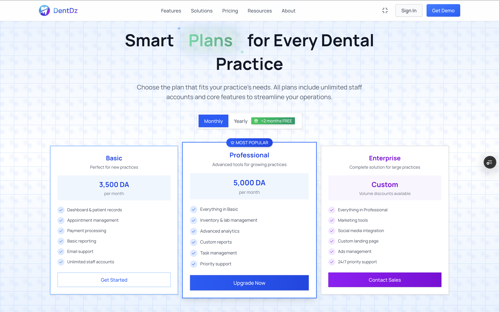

# 🦷 DentDZ

### Transform Your Dental Practice with Intelligent Management

**A complete web-based dental management SaaS platform designed to eliminate paperwork, streamline operations, and help your clinic perform better.**

[Features](#-key-features) • [Benefits](#-why-dentdz) • [Plans](#-pricing-plans) • [Get Started](#-getting-started) • [Support](#-support)

---

## 🌟 What is DentDZ?

DentDZ is a comprehensive dental management SaaS where your clinic has everything it needs to manage operations efficiently. Say goodbye to paperwork and hello to clear data, powerful statistics, and better performance.

**Built for modern dental practices of all sizes** - whether you're a solo practitioner or a multi-dentist clinic with receptionists and assistants.

---

## ✨ Key Features

### 📊 Complete Practice Management
- **Patient Management** - Complete patient records with medical history, allergies, and medications
- **Smart Appointments** - Table and calendar views with dentist assignment
- **Treatment Tracking** - Organize treatments with appointments, payments, and prescriptions
- **Financial Management** - Invoice generation, payment tracking, and expense management

### 📈 Analytics & Reports
- **10+ Advanced Graphs** - Visualize your clinic's performance
- **PDF & CSV Export** - Export any table in your preferred format
- **Custom Reports** - Generate financial, patient, and operational reports
- **Real-time Statistics** - Dashboard with key metrics

### 📦 Operations
- **Inventory Management** - Track stock, suppliers, and get low-stock alerts
- **Lab Management** - Manage lab works and track orders
- **Medicine Database** - Quick access for prescriptions
- **Document Storage** - Centralized file management

### 🔧 Advanced Tools
- **Advanced Filtering** - Filter tables by status, dates, gender, and more
- **Staff Management** - Multiple roles with custom permissions
- **Team Communication** - Collaborate between staff members
- **Prescription Generator** - Create professional prescriptions instantly

> 📖 **[View Complete Features Documentation →](./FEATURES.md)**

---

## 🎯 Why DentDZ?

### 🚀 Boost Efficiency
- ✅ **No More Paperwork** - Go completely digital
- ✅ **Save Time** - Find patient records instantly, no more searching through papers
- ✅ **Quick Access** - Everything you need in one place
- ✅ **Secure Data** - Your data is safe and backed up

### 📊 Better Insights
- 📈 View statistics in clear, visual graphs
- 💰 Track revenue and expenses easily
- 📄 Generate reports with one click
- 📊 Make data-driven decisions

### 💪 Flexible & Powerful
- 🏥 **Works with Any Clinic** - Solo practitioners to multi-dentist practices
- 👥 **Multiple Roles** - Dentists, receptionists, and assistants
- 🎨 **Clean UI & Simple UX** - Easy for anyone to use
- ⚡ **Fast & Secure** - Built with modern technology
- 📱 **Responsive** - Works on desktop, tablet, and mobile

### 🌐 All-in-One Solution
- Complete feature set in a simple way
- Assign dentists to specific appointments
- Real-time collaboration between team members
- Export data whenever you need

---

## 🌍 Language Support

| Language | Status |
|----------|--------|
| 🇬🇧 English | ✅ Available |
| 🇫🇷 French | ✅ Available |
| 🇩🇿 Arabic | 🔜 Coming Soon |

---

## 💎 Pricing Plans

### 🎁 Special Offer
**Pay yearly and get 2 months FREE!** Pay for 10 months, get 12 months of service.

> 📋 **[View Detailed Pricing Comparison →](./PRICING.md)**

---

## 🚀 Getting Started

### 1️⃣ Sign Up
Visit [dentdz.vercel.app](https://dentdz.vercel.app/) and create your account.

### 2️⃣ Free Trial
Get **7 days free trial** to test the system and see if it fits your needs.

### 3️⃣ Set Up Your Clinic
- Add your clinic information and logo
- Create staff accounts
- Start adding patients

### 4️⃣ Start Managing
Begin managing appointments, patients, and operations with ease!

---

## 📚 Documentation

| Document | Description |
|----------|-------------|
| [📖 Features](./FEATURES.md) | Complete feature documentation with screenshots |
| [👥 User Guide](./USER_GUIDE.md) | Step-by-step guide for using DentDZ |
| [💎 Pricing](./PRICING.md) | Detailed pricing and plan comparison |
| [❓ FAQ](./FAQ.md) | Frequently asked questions |
| [📞 Support](./SUPPORT.md) | How to get help |

---

## 🎥 Demo & Screenshots

### 📺 Video Demo
> 🎬 *Demo video coming soon*

### 📸 Screenshots

| Dashboard | Patient Management |
|:---------:|:------------------:|
|  |  |

| Appointments | Analytics |
|:------------:|:---------:|
|  |  |

> 🖼️ **[View More Screenshots →](./FeaturesDetails.md)**

---

## 🛠️ Built With

- **Frontend:** Next.js with TypeScript
- **Backend:** Laravel (MVC Architecture)
- **Database:** MySQL
- **Features:** Queues, Schedules, Middleware, Request Validation

---

## 🤝 Who Uses DentDZ?

DentDZ is designed for:
- 🦷 Solo dental practitioners
- 🏥 Small to medium dental clinics
- 👥 Multi-dentist practices
- 🏢 Clinics with receptionists and assistants

**Trusted by dental professionals to manage their practices efficiently.**

---

## 🌐 Connect With Us

### Social Media
*Coming Soon*

<!-- 

-->

---

## 📞 Support

Need help? We're here for you!

- 📧 **Email:** support@dentdz.com
- 💬 **In-App Support:** Available through the support page
- 📚 **Documentation:** Browse our comprehensive guides
- ❓ **FAQ:** Check our [frequently asked questions](./FAQ.md)

**Support Hours:**
- Basic Plan: Email support (24-48h response)
- Professional Plan: Priority support (12-24h response)
- Enterprise Plan: 24/7 priority support

---

## 📋 What Problems Does DentDZ Solve?

| Problem | Solution |
|---------|----------|
| 📄 Lost papers and documents | Digital records with secure cloud storage |
| ⏰ Time wasted searching for patient files | Instant search and access to any patient record |
| 📊 Difficulty tracking clinic performance | Real-time statistics and visual graphs |
| 💰 Manual billing and invoices | Automated invoice generation and payment tracking |
| 💊 Writing prescriptions manually | Digital prescription generator |
| 📈 No clear financial overview | Comprehensive financial reports and analytics |
| 🔄 Poor team communication | Built-in collaboration tools |
| 📦 Inventory management chaos | Smart inventory tracking with alerts |

---

## 🔒 Security & Privacy

Your data security is our priority:
- 🔐 Secure authentication
- 🛡️ Data encryption
- 💾 Regular backups
- 🔒 Role-based access control
- ✅ GDPR compliant

---

## 📈 Roadmap

### 🔜 Coming Soon
- 🇩🇿 Arabic language support
- 📱 Mobile apps (iOS & Android)
- 🔔 SMS & email appointment reminders
- 📊 More advanced analytics

---

## 📄 License

DentDZ is proprietary software. All rights reserved.

For licensing inquiries, please contact us at support@dentdz.com

---

## 🚀 Ready to Transform Your Practice?

**No credit card required • Full access to all features • Cancel anytime**

---

**Made with ❤️ for Dental Professionals**

*Simplifying dental practice management, one clinic at a time.*

© 2025 DentDZ. All rights reserved.

